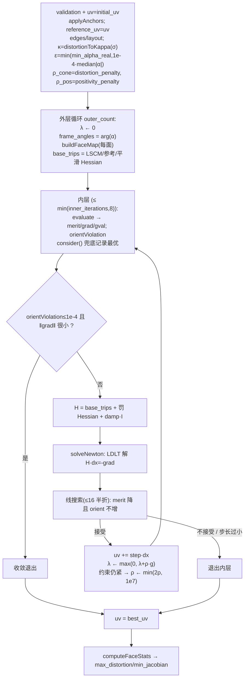

# BD-LSCM 代码分析（有界失真 LSCM）

> 目标：把「有界失真映射（Bounded Distortion Mapping）」的理论与 `BoundedDistortionMapping.cpp` 的实现逐行对应起来。
> 相关文件：
>
> | 文件 | 作用 |
> |---|---|
> | `Bounded/bounded_distortion_mapping/BoundedDistortionMapping.hpp` | 数据结构（`Options`/`Anchor`/`FaceStats`/`SolveResult`）与接口 |
> | `Bounded/bounded_distortion_mapping/BoundedDistortionMapping.cpp` | 算法实现（本文重点） |
> | `wasm/bindings_bd_lscm.cpp` | WASM/embind 导出 `solveBDLscmFull` / `runBDLscmOnMesh` |
> | `wasm/../../uv-unwrap-simple.html` | 前端页面（先把 LSCM 当初值，再调 BD-LSCM） |

---

## 0. 一句话概述

对每个三角形，把 UV 映射写成复仿射 \(w=\alpha z+\beta\bar z+\delta\)。在**逐面标架对齐**后，「共形失真 \(K\le\sigma\) 且不翻转」变成对 \((\alpha,\beta)\) 的**凸锥**
\(\{\operatorname{Re}\alpha\ge\varepsilon,\ |\beta|\le\kappa\operatorname{Re}\alpha\}\)，其中 \(\kappa=\frac{\sigma-1}{\sigma+1}\)。
于是以 **LSCM 能量**为目标，用**增广拉格朗日 + 阻尼牛顿**在稀疏 Hessian 上迭代把这个锥约束逼到满足，并用「最优迭代点兜底 + 迭代次数硬上限」保证浏览器不卡死。

---

## 1. 数学基础

### 1.1 每三角形的复仿射表示

把三角形局部坐标写成复数 \(z\)（平面网格直接用 xy；曲面网格用与 LSCM 相同的**三角形局部正交基**，见 3.2），UV 写成复数 \(w\)。同一三角形 3 个顶点给出 3 组 \((z_l,w_l)\)，其仿射拟合可写成

\[
\boxed{\,w=\alpha\,z+\beta\,\bar z+\delta\,}
\]

- \(\alpha=\partial w/\partial z\)：**共形（保角）部分**；
- \(\beta=\partial w/\partial z^\ast\)：**反共形部分**（失真来源）；
- \(\delta\)：平移。

因为 \(z_l,w_l\) 固定后 \((\alpha,\beta,\delta)\) 关于 UV 是**线性**的（3×3 复线性方程组），所以后续的约束/梯度/Hessian 都能精确写出。这就是把几何约束变成"线性 + 一个范数"的关键。

### 1.2 奇异值、Jacobian、共形失真

\(w=\alpha z+\beta\bar z\) 的实雅可比为 \(J=\begin{bmatrix}a+c & d-b\\ b+d & a-c\end{bmatrix}\)（记 \(\alpha=a+bi,\ \beta=c+di\)），其

\[
\det J=|\alpha|^2-|\beta|^2,\qquad
\sigma_1=|\alpha|+|\beta|,\quad \sigma_2=\big||\alpha|-|\beta|\big|
\]

- **保向且不翻转** \(\iff \det J>0 \iff |\alpha|>|\beta|\)；
- **共形失真** \(K=\dfrac{\sigma_1}{\sigma_2}=\dfrac{|\alpha|+|\beta|}{|\alpha|-|\beta|}\)（\(K=1\) 为共形，\(K\to\infty\) 为退化）。

### 1.3 有界失真空间 = 凸锥（核心技巧）

由 \(K\le\sigma\) 反解：

\[
\frac{|\beta|}{|\alpha|}=\frac{K-1}{K+1}\le\frac{\sigma-1}{\sigma+1}=:\kappa
\ \Longrightarrow\ |\beta|\le\kappa\,|\alpha|
\tag{1}
\]

再配合**逐面标架对齐**（每轮按当前 \(\arg\alpha\) 旋转局部标架，使 \(\arg\alpha\approx 0\Rightarrow |\alpha|\approx\operatorname{Re}\alpha\)），(1) 变成关于 \((\operatorname{Re}\alpha,\operatorname{Im}\alpha,\operatorname{Re}\beta,\operatorname{Im}\beta)\) 的**凸锥**：

\[
\operatorname{Re}\alpha\ge\varepsilon>0,\qquad |\beta|\le\kappa\operatorname{Re}\alpha
\tag{2}
\]

**为何 (2) 蕴含不翻转**：由 (2) 得 \(|\beta|\le\kappa|\alpha|\)，故
\(J=|\alpha|^2-|\beta|^2\ge(1-\kappa^2)|\alpha|^2\ge(1-\kappa^2)\varepsilon^2>0\)（因 \(\kappa<1\)）。

> 这正是 Lipman 等「bounded distortion mapping spaces」的思想：把非凸的失真约束，**在合适的标架下转成凸锥**，从而可用凸/局部凸优化求解。

### 1.4 σ 与 κ 的换算

\[
\kappa(\sigma)=\frac{\sigma-1}{\sigma+1}:\quad
\sigma{=}1\Rightarrow\kappa{=}0\ (\text{纯共形，}\beta{=}0),\quad
\sigma{=}2\Rightarrow\kappa{=}\tfrac13,\quad
\sigma\to\infty\Rightarrow\kappa\to1
\]

---

## 2. 代码地图

| 函数 / 结构 | 行号 | 作用 |
|---|---|---|
| `kConstraintsPerFace = 2` | `18` | 每面两条不等式（正定 + 锥） |
| `kMaxFactorizations = 16` | `19` | LDLT 分解总次数硬上限 |
| `triangleLocalPoints` | `46-86` | 三角形局部坐标（平面 xy / 曲面局部正交基）与面积 |
| `localSystem` | `88-109` | 组装复线性组 \(S=[z,\bar z,1]\) 并施加标架旋转 |
| `faceCoefficients` | `111-142` | 解 \(S[\alpha,\beta,\delta]^T=w\) |
| `FaceMap` | `144-149` | 逐面预计算缓存 |
| `buildFaceMap` | `151-190` | 预计算 \(M=S^{-1}\)，把 \((\alpha,\beta)\) 表达为 6 个 UV 自由度的线性函数 |
| `faceConstraint` | `193-219` | 计算 \(g_0,g_1\) 及其梯度 |
| `uniqueEdges` / `FreeLayout` / `makeFreeLayout` | `228-267` | 自由度编号（锚点固定） |
| `applyStep` | `273-277` | 按步长更新 UV |
| `evaluate` | `287-387` | 能量 + AL merit + 梯度 + 约束值 |
| `accumulateQuadHessian` | `389-436` | 二次能量 Hessian（LSCM/参考/平滑 + reg） |
| `accumulatePenaltyHessian` | `438-486` | 罚项 Hessian（含 \(|\beta|\) 的精确二阶项） |
| `solveNewton` | `488-499` | 稀疏 LDLT 解 \(H\,dx=-\nabla\) |
| `orientViolation` | `501-522` | 定向/锥违反量（用于兜底选点） |
| `medianAbsAlpha` | `533-549` | \(\varepsilon\) 的尺度归一 |
| `distortionToKappa` | `553-558` | \(\sigma\to\kappa\) |
| `computeFaceStats` | `578-602` | 输出 \(\sigma_{max},\sigma_{min},J,K,\text{cone\_violation}\) |
| `alignedFrameAngles` | `604-616` | 逐面标架角 \(\theta_f=\arg\alpha_f\) |
| `solveBoundedDistortionMap` | `618-789` | **主算法** |
| `solveBoundedDistortionLscm` | `791-804` | BD-LSCM 变体（关掉 reference/smoothness） |

---

## 3. 逐步对照

### 3.1 局部坐标与线性组

`triangleLocalPoints`（`46-86`）：
- `n×2`（平面）：`p[l] = vertices.row(faces(face,l))`，面积 \(=\tfrac12|\text{cross}_{2D}|\)；
- `n×3`（曲面）：取 \(e_1=P_1-P_0,\ n=e_1\times e_2\)，构造正交基 \(\hat x=e_1/|e_1|,\ \hat z=n/|n|,\ \hat y=\hat z\times\hat x\)，得
  \(p_0=(0,0),\ p_1=(|e_1|,0),\ p_2=(e_2\!\cdot\!\hat x,\ e_2\!\cdot\!\hat y)\)。
  —— **与 LSCM 用同一套局部基**，故 BD 与 LSCM 的能量/约束可比。

`localSystem`（`88-109`）：对 \(l=0,1,2\)
\[
S_{l,:}=\big[\ \text{rot}(\theta)\,(p_l-p_0),\ \overline{\text{rot}(\theta)\,(p_l-p_0)},\ 1\ \big]
\]
其中 `rot = std::polar(1.0, frame_angle)`。由于 \(z_0=0\)，解出的是 \(\delta=w_0\)、以及 \((\alpha,\beta)\)。

### 3.2 预计算 \(M=S^{-1}\)（`buildFaceMap`，`151-190`）

```151:190:cpp/conformal-parameterization/Bounded/bounded_distortion_mapping/BoundedDistortionMapping.cpp
    Eigen::Matrix3cd system;
    if (!localSystem(vertices, faces, face, frame_angle, system, out.area)) {
        return false;
    }
    const Eigen::Matrix3cd inv = system.inverse();
    ...
    for (int l = 0; l < 3; ++l) {
        const Complex ca = inv(0, l);
        const Complex cb = inv(1, l);
        const int x_col = 2 * l;
        const int y_col = 2 * l + 1;
        out.M[0][x_col] = ca.real();
        out.M[0][y_col] = -ca.imag();
        out.M[1][x_col] = ca.imag();
        out.M[1][y_col] = ca.real();
        out.M[2][x_col] = cb.real();
        out.M[2][y_col] = -cb.imag();
        out.M[3][x_col] = cb.imag();
        out.M[3][y_col] = cb.real();
    }
```

于是
\[
\begin{bmatrix}\operatorname{Re}\alpha\\ \operatorname{Im}\alpha\\ \operatorname{Re}\beta\\ \operatorname{Im}\beta\end{bmatrix}=M\cdot \mathrm{loc},\qquad
\mathrm{loc}=[u_0,v_0,u_1,v_1,u_2,v_2]^T
\]
（因为 \((\alpha,\beta)\) 关于 UV 线性；\(M\) 逐面缓存、后续直接复用）。

### 3.3 两条约束与梯度（`faceConstraint`，`193-219`）

\[
g_0=\varepsilon-\operatorname{Re}\alpha\le0,\qquad g_1=|\beta|-\kappa\operatorname{Re}\alpha\le0
\]
\[
\frac{\partial g_0}{\partial \mathrm{loc}_k}=-M_{0k},\qquad
\frac{\partial g_1}{\partial \mathrm{loc}_k}=\underbrace{\frac{\beta_{re}M_{2k}+\beta_{im}M_{3k}}{|\beta|}}_{\partial|\beta|/\partial \mathrm{loc}_k}-\kappa M_{0k}
\]
代码在 \(|\beta|\approx0\) 时把 \(\partial|\beta|\) 置 0（此时锥约束通常不活跃）——见 `214-216`。

### 3.4 自由度与锚点（`FreeLayout`，`242-267`）

锚点顶点被**固定**（`makeFreeLayout` 里 `pinned`），其余顶点的 \((u,v)\) 各占一个自由变量；`freeId` 给出全局编号。`applyStep`（`273-277`）按此布局更新。锚点值在 `applyAnchors`（`524-531`）写入。

### 3.5 能量与 AL merit（`evaluate`，`287-387`）

`quad`（二次能量）由三部分构成：

1. **LSCM/共形能量** \(\sum_f w_f|\beta_f|^2,\ w_f=\text{lscm\_weight}\cdot \text{area}_f\)（`303-322`）。
   最小化 \(|\beta|^2\) 即 LSCM（\(\beta=0\Rightarrow\) 共形）。
2. **参考项** \(w\sum |uv-uv_{ref}|^2\)（`324-333`）。
3. **平滑项** \(w\sum_{(i,j)}\big|\Delta uv_{ij}-\Delta uv_{ref,ij}\big|^2\)（`335-349`）。

约束用**增广拉格朗日**（`351-385`）：

\[
\text{若 } g<-\lambda/\rho:\ \text{merit}\mathrel{+}=-\tfrac{\lambda^2}{2\rho}\ (\text{无梯度});\quad
\text{否则 } \text{merit}\mathrel{+}=\lambda g+\tfrac12\rho g^2,\ \nabla\mathrel{+}=(\lambda+\rho g)\nabla g
\]

（\(\rho\)：`ci==0→rho_pos`，`ci==1→rho_cone`；\(\lambda\)：乘子向量。）

### 3.6 Hessian（`389-486`）

- `accumulateQuadHessian`：
  \(H^{lscm}_{ab}=2w_f\big(M_{2a}M_{2b}+M_{3a}M_{3b}\big)\)（`401-409`）；
  参考项 \(2w\,I\)；平滑项为边上的图 Laplacian（对角 \(2w\)、非对角 \(-2w\)，`420-431`）；末尾加 reg `1e-10`。
- `accumulatePenaltyHessian`：加 \(\rho\,\nabla g\nabla g^T\)（`474`）；对锥约束 \(g_1\) 再加精确二阶项
  \[
  h_{ab}\mathrel{+}=\text{coeff}\cdot\frac{\big(M_2^TM_2+M_3^TM_3\big)_{ab}-\hat\beta_a\hat\beta_b}{|\beta|}
  \]
  其中 \(\hat\beta_a=(\beta_{re}M_{2a}+\beta_{im}M_{3a})/|\beta|\)（`475-480`）。这是 \(|\beta|\) 的二阶信息（去掉一阶方向后才加，仅在约束活跃且 \(\text{coeff}>0\) 时）。

### 3.7 线性求解与线搜索（`488-499` + 主循环）

`solveNewton`：`SimplicialLDLT` 解 \(H\,dx=-\nabla\)，并要求 `grad·dx < 0`（下降方向）。

主循环里：
- 阻尼（LM 式）：`damp = 1e-3 * max|H_ii|`，加到对角线（`720-723`）；
- 步长上限 `max_disp = 0.25*span`（`653-657, 729-731`）；
- 回溯线搜索（≤16 次半折）：需 **merit 下降（Armijo）** 且 **定向违反不恶化**（`734-761`）。

### 3.8 标架对齐与尺度（`604-616` / `533-549`）

- `alignedFrameAngles`：\(\theta_f=\arg\alpha_f\)。外层每轮据此旋转标架 → 使新的 \(\arg\alpha\approx0\)，把锥约束"摆正"成 (2)。
- `medianAbsAlpha`：取所有面 \(|α|\) 的中位数，用于
  \(\varepsilon=\min(\text{min\_alpha\_real},\ 1e-4\cdot\text{median}|\alpha|)\)（`633-636`），避免量纲/尺度问题。
- `orientViolation`（`501-522`）：\(\max_f\{\,|\beta|-\kappa|\alpha|,\ [|\alpha|^2-|\beta|^2\le0]\Rightarrow|\beta|+1\,\}\)，作为"兜底选点"的主键。

### 3.9 输出统计（`computeFaceStats`，`578-602`）

\[
\sigma_{max}=|\alpha|+|\beta|,\quad \sigma_{min}=\big||\alpha|-|\beta|\big|,\quad
J=|\alpha|^2-|\beta|^2,\quad K=\frac{\sigma_{max}}{\sigma_{min}}\ (\sigma_{min}\le\varepsilon\Rightarrow\infty)
\]
另给 `cone_violation = max(0, |β| - κ Re α)`。主算法汇总出 `max_distortion` / `min_jacobian`。

---

## 4. 主流程 `solveBoundedDistortionMap`（`618-789`）



对应代码要点：

- 初始化：`624-657`（`κ` at `631`，`ε` at `633-636`，`max_disp` at `657`）；
- 外层：`687-765`（重置乘子 `689`；标架 `691`；`buildFaceMap` `693-695`；`base_trips` `697-699`）；
- 内层：`701-764`（`evaluate` `704`；收敛判据 `710-713`；组 Hessian `715-723`；`solveNewton` `726-727`；线搜索 `729-761`；乘子与罚因子更新 `749-757`）；
- 收尾：`767`（`uv=best_uv`）、`769-788`（统计）。

---

## 5. BD-LSCM 变体与 BD-Map 的差异

`solveBoundedDistortionLscm`（`791-804`）就是 `solveBoundedDistortionMap`，但：

```791:804:cpp/conformal-parameterization/Bounded/bounded_distortion_mapping/BoundedDistortionMapping.cpp
    Options lscm_options = options;
    if (lscm_options.lscm_weight <= 0.0) {
        lscm_options.lscm_weight = 1.0;
    }
    lscm_options.reference_weight = 0.0;
    lscm_options.smoothness_weight = 0.0;
    return solveBoundedDistortionMap(vertices, faces, initial_uv, anchors, lscm_options);
```

即：**BD-LSCM = 只有 LSCM 能量 + 有界失真/正定锥约束**（关掉参考项与平滑项）。用于「以 LSCM 解为初值，在失真上界约束下继续优化」。

---

## 6. WASM 与前端对接

`bindings_bd_lscm.cpp`：

- `solveBDLscmFull(vertices, faces, initial_uv, anchor_vertices, anchor_targets, distortion_bound, outer_iterations, inner_iterations, lscm_weight, distortion_penalty, positivity_penalty, initial_step)`（`105-181`）→ 组装 `Options` → `_solveCore`（`184-210`）→ `solveBoundedDistortionLscm`。
- `runBDLscmOnMesh(mesh, anchors, targets, distortion_bound)`（`215-264`）：在已带 LSCM 的 `Mesh` 上直接跑并回写 UV（内部固定 `lscm_weight=1, outer=4, inner=4, penalties=5000`）。

前端 `uv-unwrap-simple.html`：
1. 先用 **LSCM** 得到 `initial_uv` 与两个锚点；
2. 读滑块 σ（`getBdDistortionBound()`）作为 `distortion_bound`；
3. 调 `solveBDLscmFull(pos, faces, uvFlat, anchorVerts, anchorTargets, σ, 4, 8, 1.0, 5000, 5000, 1e-2)`；
4. 显示 `Kmax`（`max_distortion`）/`Jmin`（`min_jacobian`）。

---

## 7. 参数说明（`Options`）

| 字段 | 默认 | 是否使用 | 说明 |
|---|---|---|---|
| `distortion_bound` | `2.0` | ✅ | 失真上界 \(\sigma\)，映射为 \(\kappa\) |
| `min_alpha_real` | `1e-6` | ✅ | \(\operatorname{Re}\alpha\) 下界 \(\varepsilon\)（再与中位尺度取 min） |
| `lscm_weight` | `0.0` | ✅ | LSCM 能量权重（BD-LSCM 强制 ≥1） |
| `distortion_penalty` | `100.0` | ✅ | 锥约束罚因子初值 `rho_cone` |
| `positivity_penalty` | `100.0` | ✅ | 正定约束罚因子初值 `rho_pos` |
| `reference_weight` | `1e-3` | ✅ | 参考项权重（BD-LSCM 置 0） |
| `smoothness_weight` | `1e-2` | ✅ | 平滑项权重（BD-LSCM 置 0） |
| `outer_iterations` | `8` | ✅ | 外层轮数（每轮重排标架 + 重置乘子） |
| `inner_iterations` | `200` | ✅ | 内层牛顿步上限，**实际被 `min(...,8)` 截断** |
| `initial_step` | `1e-2` | ❌ | 未使用（保留接口，牛顿步长由线搜索决定） |
| `gradient_tolerance` | `1e-10` | ❌ | 未使用（收敛判据用局部常量 `grad_tol=1e-6`） |

---

## 8. 工程保护与已知限制

- **分解次数上限**：`kMaxFactorizations = 16`（`19`），内层每轮 ≤8、外层 ≤`outer_iterations`；超限即停——避免阻塞浏览器主线程（头文件注释亦说明）。
- **步长上限**：`max_disp = 0.25·span`，防止牛顿步过大导致翻面/震荡。
- **最优迭代点兜底**：`consider()`（`659-667`）以 `orientViolation` 为主序、能量为次序记录 `best_uv`，最终返回它。
- **罚因子自适应**：约束仍紧时 \(\rho\leftarrow\min(2\rho,10^7)\)（`754-757`）。
- **退化三角形**：`triangleLocalPoints`/`localSystem` 判定失败则该面 `ok=false` 跳过。
- **约束线性化依赖标架**：\(g_0\) 用 \(\operatorname{Re}\alpha\)（而非 \(|\alpha|\)），只有在标架对齐（\(\arg\alpha\approx0\)）时才与"正定/锥"等价；因此**外层必须重排标架**。
- **曲面情形**：`n×3` 顶点按每面局部正交基计算（与 LSCM 一致），故不使用全局 xy 投影。

---

## 9. 参考文献

- Lipman, Aigerman 等. *Bounded distortion mapping spaces for triangular meshes*. SIGGRAPH 2012.（有界失真空间与凸锥）
- Lévy 等. *Least squares conformal maps (LSCM)*. SIGGRAPH 2002.（\(\min\sum|\beta|^2\)）
- Nocedal & Wright. *Numerical Optimization*.（增广拉格朗日、阻尼牛顿、回溯线搜索）

